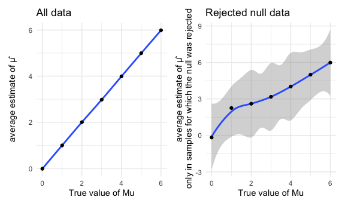

Homework 5
================
Ronae McLin
11/11/2020

``` r
library(tidyverse)
```

    ## ── Attaching packages ─────────────────────────────────────── tidyverse 1.3.0 ──

    ## ✓ ggplot2 3.3.2     ✓ purrr   0.3.4
    ## ✓ tibble  3.0.1     ✓ dplyr   1.0.0
    ## ✓ tidyr   1.1.0     ✓ stringr 1.4.0
    ## ✓ readr   1.3.1     ✓ forcats 0.5.0

    ## ── Conflicts ────────────────────────────────────────── tidyverse_conflicts() ──
    ## x dplyr::filter() masks stats::filter()
    ## x dplyr::lag()    masks stats::lag()

``` r
library(patchwork)

knitr::opts_chunk$set(
  fig.width = 6,
  fig.asp = .6,
  out.width = "90%"
)
theme_set(theme_minimal() + theme(legend.position = "bottom"))

options(
  ggplot2.continuous.colour = "viridis",
  ggplot2.continuous.fill = "viridis"
)

scale_colour_discrete = scale_color_viridis_d

scale_fill_discrete = scale_fill_viridis_d
```

# Problem 1

Importing data

``` r
homicide_df = read_csv(file = "./homicide-data.csv")
```

    ## Parsed with column specification:
    ## cols(
    ##   uid = col_character(),
    ##   reported_date = col_double(),
    ##   victim_last = col_character(),
    ##   victim_first = col_character(),
    ##   victim_race = col_character(),
    ##   victim_age = col_character(),
    ##   victim_sex = col_character(),
    ##   city = col_character(),
    ##   state = col_character(),
    ##   lat = col_double(),
    ##   lon = col_double(),
    ##   disposition = col_character()
    ## )

**Raw data explanation**

The raw homicide data frame contains the variables: uid, reported\_date,
victim\_last, victim\_first, victim\_race, victim\_age, victim\_sex,
city, state, lat, lon, disposition. There are a total of 52179
observations contained within. Upon first glance it appears that we will
need to tidy the variable concerning the reported data of the incident
that occurred. Data collected for this frame was by The Washington Post,
it gathered information on homicides in 50 large U.S. cities

Create city\_state variable & resolved variable

``` r
tidy_homicide_df = 
homicide_df %>% 
  mutate(
    city_state = str_c(city, state, sep = "_"),
    resolved = case_when(
      disposition == "Closed without arrest" ~ "unsolved",
      disposition == "Open/No arrest"        ~ "unsolved",
      disposition == "Closed by arrest"      ~ "solved",
    ))
```

``` r
homicide_summary_df = 
  tidy_homicide_df %>% 
  group_by(city_state) %>% 
  summarize(
    hom_total = n(),
    hom_unsolved = sum(resolved == "unsolved")
  )
```

    ## `summarise()` ungrouping output (override with `.groups` argument)

Prop test for Baltimore, MD

``` r
prop.test(
  homicide_summary_df %>% 
    filter(city_state == "Baltimore_MD") %>% pull(hom_unsolved) 
  
 , homicide_summary_df %>% filter(city_state == "Baltimore_MD") %>% pull(hom_total)) %>% 
  broom::tidy()
```

    ## # A tibble: 1 x 8
    ##   estimate statistic  p.value parameter conf.low conf.high method    alternative
    ##      <dbl>     <dbl>    <dbl>     <int>    <dbl>     <dbl> <chr>     <chr>      
    ## 1    0.646      239. 6.46e-54         1    0.628     0.663 1-sample… two.sided

Running a prop test for each city in the data frame

``` r
results_df = 
  homicide_summary_df %>% 
  mutate(
    prop_tests = map2(.x = hom_unsolved, .y = hom_total, ~prop.test(x = .x, n = .y)),
    tidy_tests = map(.x = prop_tests, ~broom::tidy(.x))
  ) %>% 
  select(-prop_tests) %>% 
  unnest(tidy_tests) %>% 
  select(city_state, estimate, conf.low, conf.high)
```

    ## Warning in prop.test(x = .x, n = .y): Chi-squared approximation may be incorrect

A plot that shows the estimates and CIs for each city

``` r
results_df %>% 
  mutate(city_state = fct_reorder(city_state, estimate)) %>% 
  ggplot(aes(x = city_state, y = estimate)) +
  geom_point() + 
  geom_errorbar(aes(ymin = conf.low, ymax = conf.high)) + 
  theme(axis.text.x = element_text(angle = 90, vjust = 0.5, hjust = 1))
```


# Problem 2

Import the data

``` r
path_df = 
  tibble(
    path = list.files("data")
  ) %>% 
  mutate(
    path = str_c("data/", path),
    data = map(path, ~read_csv(.x))
    )  
```

    ## Parsed with column specification:
    ## cols(
    ##   week_1 = col_double(),
    ##   week_2 = col_double(),
    ##   week_3 = col_double(),
    ##   week_4 = col_double(),
    ##   week_5 = col_double(),
    ##   week_6 = col_double(),
    ##   week_7 = col_double(),
    ##   week_8 = col_double()
    ## )
    ## Parsed with column specification:
    ## cols(
    ##   week_1 = col_double(),
    ##   week_2 = col_double(),
    ##   week_3 = col_double(),
    ##   week_4 = col_double(),
    ##   week_5 = col_double(),
    ##   week_6 = col_double(),
    ##   week_7 = col_double(),
    ##   week_8 = col_double()
    ## )
    ## Parsed with column specification:
    ## cols(
    ##   week_1 = col_double(),
    ##   week_2 = col_double(),
    ##   week_3 = col_double(),
    ##   week_4 = col_double(),
    ##   week_5 = col_double(),
    ##   week_6 = col_double(),
    ##   week_7 = col_double(),
    ##   week_8 = col_double()
    ## )
    ## Parsed with column specification:
    ## cols(
    ##   week_1 = col_double(),
    ##   week_2 = col_double(),
    ##   week_3 = col_double(),
    ##   week_4 = col_double(),
    ##   week_5 = col_double(),
    ##   week_6 = col_double(),
    ##   week_7 = col_double(),
    ##   week_8 = col_double()
    ## )
    ## Parsed with column specification:
    ## cols(
    ##   week_1 = col_double(),
    ##   week_2 = col_double(),
    ##   week_3 = col_double(),
    ##   week_4 = col_double(),
    ##   week_5 = col_double(),
    ##   week_6 = col_double(),
    ##   week_7 = col_double(),
    ##   week_8 = col_double()
    ## )
    ## Parsed with column specification:
    ## cols(
    ##   week_1 = col_double(),
    ##   week_2 = col_double(),
    ##   week_3 = col_double(),
    ##   week_4 = col_double(),
    ##   week_5 = col_double(),
    ##   week_6 = col_double(),
    ##   week_7 = col_double(),
    ##   week_8 = col_double()
    ## )
    ## Parsed with column specification:
    ## cols(
    ##   week_1 = col_double(),
    ##   week_2 = col_double(),
    ##   week_3 = col_double(),
    ##   week_4 = col_double(),
    ##   week_5 = col_double(),
    ##   week_6 = col_double(),
    ##   week_7 = col_double(),
    ##   week_8 = col_double()
    ## )
    ## Parsed with column specification:
    ## cols(
    ##   week_1 = col_double(),
    ##   week_2 = col_double(),
    ##   week_3 = col_double(),
    ##   week_4 = col_double(),
    ##   week_5 = col_double(),
    ##   week_6 = col_double(),
    ##   week_7 = col_double(),
    ##   week_8 = col_double()
    ## )
    ## Parsed with column specification:
    ## cols(
    ##   week_1 = col_double(),
    ##   week_2 = col_double(),
    ##   week_3 = col_double(),
    ##   week_4 = col_double(),
    ##   week_5 = col_double(),
    ##   week_6 = col_double(),
    ##   week_7 = col_double(),
    ##   week_8 = col_double()
    ## )
    ## Parsed with column specification:
    ## cols(
    ##   week_1 = col_double(),
    ##   week_2 = col_double(),
    ##   week_3 = col_double(),
    ##   week_4 = col_double(),
    ##   week_5 = col_double(),
    ##   week_6 = col_double(),
    ##   week_7 = col_double(),
    ##   week_8 = col_double()
    ## )
    ## Parsed with column specification:
    ## cols(
    ##   week_1 = col_double(),
    ##   week_2 = col_double(),
    ##   week_3 = col_double(),
    ##   week_4 = col_double(),
    ##   week_5 = col_double(),
    ##   week_6 = col_double(),
    ##   week_7 = col_double(),
    ##   week_8 = col_double()
    ## )
    ## Parsed with column specification:
    ## cols(
    ##   week_1 = col_double(),
    ##   week_2 = col_double(),
    ##   week_3 = col_double(),
    ##   week_4 = col_double(),
    ##   week_5 = col_double(),
    ##   week_6 = col_double(),
    ##   week_7 = col_double(),
    ##   week_8 = col_double()
    ## )
    ## Parsed with column specification:
    ## cols(
    ##   week_1 = col_double(),
    ##   week_2 = col_double(),
    ##   week_3 = col_double(),
    ##   week_4 = col_double(),
    ##   week_5 = col_double(),
    ##   week_6 = col_double(),
    ##   week_7 = col_double(),
    ##   week_8 = col_double()
    ## )
    ## Parsed with column specification:
    ## cols(
    ##   week_1 = col_double(),
    ##   week_2 = col_double(),
    ##   week_3 = col_double(),
    ##   week_4 = col_double(),
    ##   week_5 = col_double(),
    ##   week_6 = col_double(),
    ##   week_7 = col_double(),
    ##   week_8 = col_double()
    ## )
    ## Parsed with column specification:
    ## cols(
    ##   week_1 = col_double(),
    ##   week_2 = col_double(),
    ##   week_3 = col_double(),
    ##   week_4 = col_double(),
    ##   week_5 = col_double(),
    ##   week_6 = col_double(),
    ##   week_7 = col_double(),
    ##   week_8 = col_double()
    ## )
    ## Parsed with column specification:
    ## cols(
    ##   week_1 = col_double(),
    ##   week_2 = col_double(),
    ##   week_3 = col_double(),
    ##   week_4 = col_double(),
    ##   week_5 = col_double(),
    ##   week_6 = col_double(),
    ##   week_7 = col_double(),
    ##   week_8 = col_double()
    ## )
    ## Parsed with column specification:
    ## cols(
    ##   week_1 = col_double(),
    ##   week_2 = col_double(),
    ##   week_3 = col_double(),
    ##   week_4 = col_double(),
    ##   week_5 = col_double(),
    ##   week_6 = col_double(),
    ##   week_7 = col_double(),
    ##   week_8 = col_double()
    ## )
    ## Parsed with column specification:
    ## cols(
    ##   week_1 = col_double(),
    ##   week_2 = col_double(),
    ##   week_3 = col_double(),
    ##   week_4 = col_double(),
    ##   week_5 = col_double(),
    ##   week_6 = col_double(),
    ##   week_7 = col_double(),
    ##   week_8 = col_double()
    ## )
    ## Parsed with column specification:
    ## cols(
    ##   week_1 = col_double(),
    ##   week_2 = col_double(),
    ##   week_3 = col_double(),
    ##   week_4 = col_double(),
    ##   week_5 = col_double(),
    ##   week_6 = col_double(),
    ##   week_7 = col_double(),
    ##   week_8 = col_double()
    ## )
    ## Parsed with column specification:
    ## cols(
    ##   week_1 = col_double(),
    ##   week_2 = col_double(),
    ##   week_3 = col_double(),
    ##   week_4 = col_double(),
    ##   week_5 = col_double(),
    ##   week_6 = col_double(),
    ##   week_7 = col_double(),
    ##   week_8 = col_double()
    ## )

Tidying the recently imported data

``` r
tidy_df =
path_df %>% 
 mutate(
path = str_replace(path, "data/con", "control"),
path = str_replace(path, "data/exp", "experiment"),
path = str_replace(path, ".csv", "")
) %>% 
   unnest(data) %>% 
   separate(
   path, into = c("treatment","id")
 ) %>% 
  pivot_longer( 
    week_1:week_8,
    names_to = "week",
    values_to = "value"
  ) %>% 
  mutate(
    treatment = as.factor(treatment),
    id = as.factor(id),
    week = as.factor(week)
  )
```

Spaghetti plot\!

``` r
tidy_df %>% 
 
  ggplot(aes( x = week, y = value, group = id, color = id)) + geom_line() +  facet_grid(cols = vars(treatment)) + 
  theme(axis.text.x = element_text(angle = 90, vjust = 0.5, hjust = 1))
```


We can see from the plot that when comparing the control and experiment
group, the experiment group across the weeks of the study has the
highest amount of values recorded. Focusing in on the control group, the
values recorded relatively stayed the same over the span of 8 weeks. For
the experiment group, the values increased incrementally over the course
of 8 weeks.This makes sense considering the placebo effect of the
control.

# Problem 3

Set up the function that is to be used.

``` r
sim_ms = function(n = 30, mu, sigma = 5) {
  
  sim_data = tibble(
    x = rnorm(n = n, mean = mu, sd = sigma)
  )
  
  sim_data %>% 
    summarize(
      mu = mean(x),
      sigma = sd(x))
      
      sim_data %>% 
     t.test() %>% 
    broom::tidy() %>% 
        select(estimate, p.value)
  
}
```

Set μ=0 Generate 5000 datasets from the model x∼Normal\[μ,σ\]

``` r
zero_output = 
  rerun(5000, sim_ms(30, 0, 5)) %>% 
  bind_rows() %>% 
  select(
    estimate, p.value
  )

zero_output
```

    ## # A tibble: 5,000 x 2
    ##    estimate p.value
    ##       <dbl>   <dbl>
    ##  1    1.39   0.101 
    ##  2    1.26   0.161 
    ##  3   -0.690  0.459 
    ##  4   -0.216  0.812 
    ##  5   -1.59   0.0374
    ##  6    1.22   0.277 
    ##  7   -0.543  0.549 
    ##  8   -0.130  0.902 
    ##  9   -0.518  0.536 
    ## 10    1.02   0.357 
    ## # … with 4,990 more rows

Re running our previously set function for μ={0,1,2,3,4,5,6}

``` r
new_six = 
  tibble(
    mu = c(0, 1, 2, 3, 4, 5, 6)) %>% 
      mutate(
        output_list = map(.x = mu, ~rerun(5000, sim_ms(mu = .x))),
        output_df = map(output_list, bind_rows)
      ) %>% 
      unnest(output_df) %>% 
      select(-output_list)
```

Plot showing the power of the test

``` r
power_plot = 
new_six %>% group_by(mu) %>% 
  count(p.value < .05) %>% 
  mutate(
    power = n/sum(n)
  ) %>% janitor::clean_names() %>% 
  filter(p_value_0_05 == TRUE) %>% 
  ggplot(aes(x = mu, y = power)) + geom_point() + geom_smooth() + labs(
    
    title = "The association between effect size and power",
      x = "True value of Mu",
    y = "Power"
  )
```

The association between effect size and power is visualized in the
rejection\_plot. We can see that as the true value of mu for the sample
increases, or in this case deviates from the null value of 0, the effect
size increases. This increase in the effect size results in the increase
of the power for the study. Power is (1- Beta), the probability of
avoiding a type II error. Even at a considerably small effect size, when
the true value of mu is very close to the null mu value, we see that the
power is just above 0.0 and is not exactly 0. I understand this is due
to the random error and chance associated with studies that were
simulated.

Setting up data frame for samples in which null is rejected

``` r
rejected_data = 
new_six %>% 
mutate(
test_results = case_when(
p.value < .05 ~ "reject",
p.value >= .05 ~ "fail to reject"
)) %>% 
  filter(
    test_results == "reject"
  ) %>% 
  group_by(mu)
```

null is rejected data plot

``` r
reject_plot =
rejected_data %>% 
  summarize(
    mean_reject = mean(estimate)
  ) %>% 
  ggplot(aes(x = mu, y = mean_reject)) + geom_smooth() + geom_point() +
labs(
    
    title = "Rejected null data",
      x = "True value of Mu",
    y = "average estimate of μ̂
 only in samples for which the null was rejected"
  )
```

    ## `summarise()` ungrouping output (override with `.groups` argument)

Setting up data frame for all samples

``` r
all_data = 
new_six %>% 
mutate(
test_results = case_when(
p.value < .05 ~ "reject",
p.value >= .05 ~ "fail to reject"
))  %>% 
  group_by(mu)
```

Plot for all of the samples

``` r
all_plot = 
all_data %>% 
  summarize(
    mean_all = mean(estimate)
  ) %>% 
  ggplot(aes(x = mu, y = mean_all)) + geom_smooth() + geom_point() +
labs(
    
    title = "All data",
      x = "True value of Mu",
    y = "average estimate of μ̂
 "
  )
```

    ## `summarise()` ungrouping output (override with `.groups` argument)

Final plots\!\!

``` r
all_plot + reject_plot
```

    ## `geom_smooth()` using method = 'loess' and formula 'y ~ x'
    ## `geom_smooth()` using method = 'loess' and formula 'y ~ x'



We see the most deviation between the average estimate of mu for all
data and for the rejected null hypothesis data when the true value of mu
is in the lower range (closer to the value of 0). The sample average of
μ̂ across tests for which the null is rejected becomes more equal to
the true value of μ as the true value increases.
